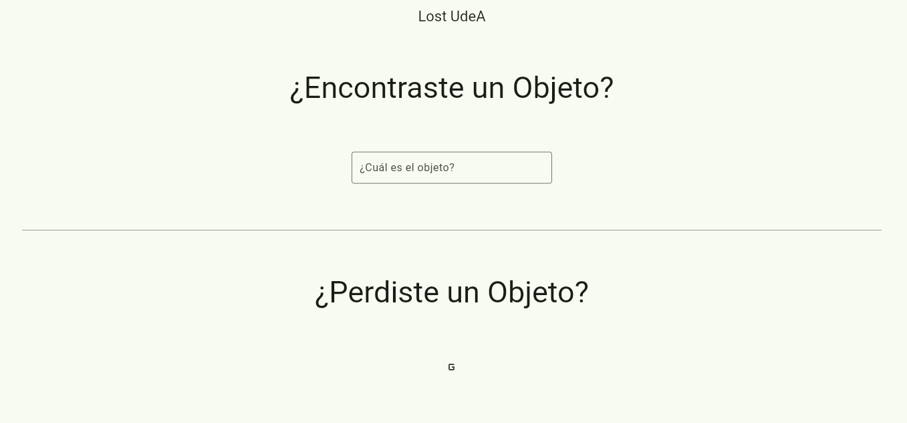

# 🛠️ Proyecto: Objetos Perdidos - Lost UdeA

[](https://flutter.dev)


[](https://github.com/sebudea/lostudea/actions/workflows/build.yml)



## 📖 Descripción General

**LostUdeA** es una aplicación Web Flutter diseñada para facilitar la búsqueda y recuperación de objetos perdidos dentro de la **Universidad de Antioquia**.  
Permite a estudiantes, profesores, personal y visitantes publicar anuncios de objetos perdidos o encontrados, incluyendo descripciones, fotografías, ubicación y fecha.

También ofrece herramientas de búsqueda avanzada por categorías y palabras clave, así como notificaciones automáticas cuando se detectan coincidencias.

**Estado Actual:** En desarrollo

**Última Actualización:** Mayo 2025

## 🚀 Características Principales

- ✅ Publicación de objetos perdidos/encontrados con foto y descripción
- ✅ Filtros de búsqueda por categoría, palabra clave, fecha y lugar
- ✅ Notificaciones automáticas ante coincidencias

<!-- ## 📂 Estructura del Proyecto

```plaintext
root/
├── lib/                  # Código fuente principal
├── assets/               # Recursos como imágenes, fuentes, etc.
├── test/                 # Pruebas automatizadas
├── config/               # Archivos de configuración
├── scripts/              # Scripts de despliegue o utilitarios
├── README.md             # Este archivo
``` -->


## 🛠️ Requisitos Técnicos

### 1. Entorno de Desarrollo:

- Flutter SDK: >= 3.5.3
- Dart: >= 3.0.0
- IDE recomendado: VS Code

### 2. Dependencias Clave:

- `freezed` - Modelo de datos inmutables

- `flutter_auth` - Inicio de Sesion con Google

- `firestore` - Base de datos

- `firebase_core` - Inicialización de Firebase

- `image_picker` - Selección de imágenes desde el dispositivo

### 3. Servicios de Terceros:

- **Firebase** - Autenticación, Firestore y almacenamiento de imágenes


## 🔧 Configuración Inicial

1. Clona este repositorio:

```bash
git clone https://github.com/sebudea/lostudea
```

2. Navega al directorio:

```bash
cd lostudea
```

3. Instala las dependencias:

```bash
flutter pub get
```

4. Ejecuta la aplicación:

```bash
flutter run
```

## 📦 Despliegue

### 📍 Producción Automatizada (GitHub + Vercel)

Este proyecto usa GitHub Actions y Vercel para desplegar automáticamente los cambios cada vez que se hace push a la rama `main`.

1. Haces `git push` a `main`.

2. GitHub Actions construye el proyecto (build de Flutter Web).

3. El artefacto generado se despliega automáticamente en Vercel.

### 📍 Entorno de Pruebas

Las pruebas unitarias y de integración se ejecutan automáticamente como parte del proceso de CI/CD gracias a GitHub Actions. Cada vez que se hace un push en la rama principal, se ejecutan las pruebas de la aplicación y, si todas pasan correctamente, se genera un nuevo artefacto para el despliegue en Vercel.


## 🔄 Mantenimiento

1. Actualización de Dependencias:

```bash
flutter pub upgrade
```

2. Limpieza de Caché:

```bash
flutter clean
```

## 📞 Contacto y Soporte

- **Desarrolladores Responsables**: Sebastian Aristizabal Castañeda, Luis Mateo Ochoa, Alejandro Arias Ortiz
- **GitHub**: [Sebastian](https://github.com/sebudea), [Mateo](https://github.com/mate38a), [Alejandro](https://github.com/AlejoAriasO),

## 📝 Licencia
Este proyecto es privado y no está disponible para distribución pública. Todos los derechos reservados por sebudea.
